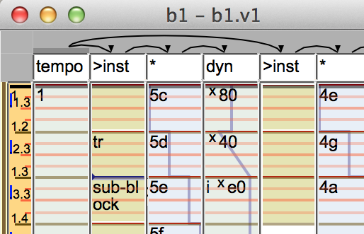

[back to overview](overview.md.html#karya)

Derivation is the process that turns the UI level score of blocks, tracks, and
events into a stream of score events, which is input for the
[performer](performance.md.html).  While a UI event ('Ui.Event.Event')
corresponds directly to a bit of text in the score, a score event
('Derive.Score.Event') has a pitch signal, control signals, instrument, and
everything else that's needed by the performer.

## Derivation

Derivation starts from a root block.  You can derive from any block, but for
convenience one block is marked as the root with 'Ui.Ui.config_root', and
derivation normally starts from there.  The eventual output of derivation is a
stream of 'Derive.Score.Event's.

Tracks are arranged hierarchically, as expressed by the lines and arrows in
the "skeleton", which is graphically displayed above the track titles.  A
parent track has scope over its children, which means it sets the environment
in which the children evaluate.

There is a lot of talk about "inheriting such and such from the environment".
There's a detailed explanation of the [dynamic
environment](#dynamic-environment) below, but the short version is that it's
a dynamically scoped set of variables.

Tracks are divided into two kinds: note tracks, and control tracks.  Control
tracks are further divided into tempo, control, and pitch.  The type of a track
is indicated by its title.  Note tracks begin with `>`, pitch tracks begin with
`*`, tempo tracks are called `tempo`, and tracks starting with letters set
controls of that name.  Full details are in 'Derive.ParseTitle'.  Note tracks
generate events, and control tracks generate a control signal and put it into
the dynamic environment.  What all of that means will be defined later.

For example, a common block configuration is one tempo track which is parent to
the toplevel tracks.  Below that are a note tracks `>inst`, which set the
instrument to `inst`, each with a pitch track `*` and control track `dyn` below
it.  `*` establishes a pitch track, but doesn't set the scale, so it'll be
inherited from the environment, and `dyn` is a dynamics track.  Though they
appear as children to the note track, by the time
[inversion](#slicing-and-inversion) gets done with them they are actually above
it, establishing pitch and dynamics for each note.

The events in a control track are generally numbers which set the control
signal at that point in time (e.g. `x80` in the screenshot), or possibly calls
which interpolate to create lines or curves (`i xe0` in the screenshot), the
events of a pitch track will be names of scale degrees and possible arguments,
and the events of a note track will generally be empty to generate a single
note, or have an ornament name (`tr`) to do something fancier.  If a note track
event has the name of another block (`sub-block`), that block will be
substituted in the place of the event---this is one way to construct scores
hierarchically, write repeats, factor out common phrases, etc.  If a sub-block
has a tempo track the tempos will compose, so a phrase with rubato built-in
will also accelerate if the calling block has an accelerating tempo.

Since control and pitch track calls are usually points in a curve, they tend
to be zero duration, while note track events tend to have a duration.  There
are exceptions, for instance a pedal or switch control might use the event
duration, while a percussion instrument may have no need for note duration.

## track evaluation

Each kind of track is evaluated in its own way, but they are all similar.

When a track is evaluated, the text of each UI event is evaluated, and the
results from each one are merged.  Any evaluation errors will be logged and
abort the evaluation of that event.

In addition to the arguments, each call actually gets a whole bunch of other
information ('Derive.Deriver.Monad.CallInfo').  Notably, it gets the event
start and duration, along with previous and subsequent events, so calls know
where their neighbors are.  It also gets the last value of the previous call,
which is used by control calls, some of which want to interpolate from the
previous value.

### note track

Note tracks look like `>` or `>inst` or `>inst arg1 arg2 | blah blah`.  They
are passed as arguments to a `note-track` transformer whose default behaviour
is to set the current instrument and possibly attributes, the same as the
[default null note call](#call-docs).  Similar to scales, setting the
instrument will bring the instrument's calls into scope, as documented under
[instruments](#instruments).  The `note-track` call will apply a transformer
with the same name as the instrument, if it exists.  You can use this to make
an instrument automatically apply a certain variable or postproc.  You can
create the appropriate transformer via a [ky file](ui.md.html#ky-file).

You can optionally append a [expression pipeline](#expression-pipeline), and
the expressions will be called as a transformer around the whole track.  So
`>inst | t1 | x = 42` will evaluate the track with `x` set to `42` and
transformed by `t1`.

Note tracks can have children, by virtue of a complicated process called
[slicing and inversion](#slicing-and-inversion).

### pitch track

Pitch tracks look like `*`, `*scale` or `*scale #name`.  They set the scale to
`scale` and evaluate the track as a pitch track.  A plain `*` will use the
scale currently in scope.  Setting a scale also has the effect of bringing the
scale's calls into scope, as documented under [scales](#scales).  The generated
pitch signal will replace the default unnamed pitch signal in scope, unless you
give a `#name`.  There is no facility for combining pitch tracks as there is
for control tracks.  Relative pitch signals are instead implemented by a
control signal that represents chromatic or diatonic transposition.  What those
are depends on the scale, but the defaults are 'Derive.Score.c_chromatic',
'Derive.Score.c_diatonic' and 'Derive.Score.c_hz'.  As with control tracks, you
can append a [transformer pipeline](#expression-pipeline).  Pitch tracks are
highly related to [scales](#scales).

### control track

Control tracks look like `control`, `add control` or `%`.  If a control with
the same name is already in scope, the new track will be merged with it.
The default merge depends on the signal: additive for controls which are
'Derive.Controls.is_additive' and multiplicative for the rest.  There's also a
`default-merge` call you can use to configure that locally.

This behaviour can be changed with a leading "operator", e.g.  `set c` will
replace `c`, or `add c` will add to it.  The complete set of merge operators is
listed in 'Derive.Deriver.Monad.mergers'.

`%` is an unnamed control track and is used only by [control block
calls](#control-block-calls).

As with note tracks, you can append a [transformer
pipeline](#expression-pipeline).

Control tracks put their control into scope for their children, so a control
track should always have children (a control track below a note track may not
look like it has children, but in fact it does, courtesy of inversion).

Control track titles can have a [type suffix](#number-types), if which case
they indicate the type of they generate.  For instance, `delay-time:s` will
create a control which the `delay` call will interpret as being in RealTime
seconds.

### tempo track

Tempo tracks are titled `tempo`, followed by an optional word.  The track is
just a normal control track, but the generated signal will be composed with the
warp signal in scope.  Normally a single tempo track will have scope over all
the tracks in a block, but it's also possible to have multiple tempo tracks.

The optional word can be `abs` or `hybrid`.  `abs` is implemented by
'Derive.Tempo.with_absolute', and `hybrid` is implemented by
'Derive.Tempo.with_hybrid'.

### Slicing and inversion

[Slicing and inversion](slicing-inverting.md.html) is a score level
transformation that happens at when a track is derived.

## Dynamic environment

The dynamic environment concept is core to derivation.  The idea is that
instead of manipulating output of music generating functions (that's score
events or signals), the various score constructs may manipulate the
environment, though they may also directly manipulate the derived output if
they choose.  This is so that high level transformations can delay the decision
of what exactly that transformation means to a lower level bit of score or
instrument that may then interpret it in its own way.

For instance, to reduce the volume of a phrase, instead of generating the notes
and then modifying their "dyn" signal (for "dynamics"), you can modify the dyn
signal in the environment, and when the notes are eventually generated they
will inherit the dyn signal.  But any function in between (or the eventual
event generating function) can intercept that signal and treat it specially,
e.g. by resetting the dyn signal and doubling the instrument.  Or the
instrument itself could respond to the dyn signal, e.g. by making intonation
less accurate when playing loudly.

The dynamic environment ('Derive.Deriver.Monad.Dynamic') consists of a scope,
control signals, pitch signals, a warp signal, and a map of scalar values
called the "environment".  As its name suggests, it implements dynamic scope:
while values may not be mutated, they can be rebound within the dynamic scope
of a call.

### controls

Control signals are floating point values that change in time, by convention
ranging from 0--1 or perhaps -1--1, depending on what is controlled.  Pitch
signals are similar, except the values are abstract objects that can have
numeric controls applied to them, for instance chromatic or diatonic
transposition, and later evaluated to a normal control signal representing
frequency.  The warp signal is the same as a control signal, except it's used
to control [ScoreTime to RealTime mapping](#scoretime-and-realtime).

Control signals may carry types also, for instance to document whether a
transposition signal is in chromatic or diatonic steps, or whether a delay
signal is in ScoreTime or RealTime, as in 'Derive.ScoreTypes.Typed'.

### environ

The environ ('Derive.Env') is different: it holds constant [vals](#vals), but
they they may be typed.  For instance, the key of a section of music is a
string, the current instrument is an instrument type, and a `trill-depth` value
might be a typed number, e.g.  `2d` for 2 diatonic steps.  As documented in
[Calls](#calls), the environ is also used for argument defaulting.

Controls and environ vals are separate!  This can be a bit confusing, because
a call may expect default values in the environ, which you would set like
`legato-detach = .1`, while it may get another value from a control, which you
would set like `%legato-overlap = .5`.  If you leave off the `%`, you wind up
setting an env val instead of a control, and nothing happens!

Environ keys are arbitrary strings, but there is a set of standard ones, which
are understood by the built-in derivation functions or scales, documneted in
'Derive.EnvKey'.

TODO: it would probably be possible to unify all the environ types into a
single map of typed signals.

### scopes

The dynamic value 'Derive.Deriver.Monad.Scopes' determines the calls in scope,
and maps names to the functions implementing the call.  [Calls](#calls) are
documented in more detail elsewhere, but the fact that they are in
'Derive.Deriver.Monad.Dynamic' means that the set of calls in scope can also be
modified within a dynamic scope.  There are separate namespaces for note
tracks, control tracks, and pitch tracks since the calls in each track return
different types.  This is what allows an instrument to bring into scope
instrument-specific calls, or a scale to bring into scope calls that emit its
scale degrees.

### Attributes

Score events can also have attributes attached to them.  Attributes are just a
set of strings, that are intended to be interpreted by the performer based on
the instrument.  They are written separated with `+`s like `+trem+cresc`.  For
instance, `+pizz` may cause an instrument that understands it to emit a
keyswitch to play the affected notes as pizzicato.  Attributes can also be
used by percussion, e.g. `+sn` for a snare, or `+hh` for high-hat.  Drums are
also likely to support combinations of attributes, such as `+hh+open`.
Attributes can be any string, but a set of standard names is in
'Derive.Attrs'.

Attributes are a set, so they can be combined piecemeal.  For example, there
is a built-in note call that matches calls starting with `+`, so if you write
`+trem | x`, then `+trem` will be added to the attribute set for `x`, which
will presumably cause everything under it to play as tremolo.  If one of the
notes underneath has a `+cresc`, then the instrument will get `+trem+cresc`,
which it might have a special sample for, or it might decide which one to
apply based on priority.  Details are in 'Perform.Midi.Patch.AttributeMap'.

Note that there are two different approaches here: a tremolo could be realized
as the `+trem` attribute, which delays the realization to the instrument.  Or
it could be realized in the deriver by repeating the note rapidly, or rolling
a chord, or whatever.  The attribute approach is much less flexible, but can
sound better if you're using one of those fancy sample libraries.  Usually an
instrument should configure its scopes appropriately, for instance if the
instrument has a tremolo keyswitch it can replace the `trem` call with one
that sets an attribute, or if it has canned grace note samples it might use
attributes for the intervals which are available, or realize manually for
intervals that don't have samples.

To the deriver, attributes are just a set of strings, the actual realization
is at the [performance](performance.md.html) level, and therefore dependent on
the backend.  The various fancy ways instruments can respond to attributes are
documented with [instruments](instrument.md.html).

### events

When a 'Derive.Score.Event' is generated, it inherits the controls, pitch,
instrument, and attributes in scope.  After that it's up to the performer to
interpret those values, which are likely also dependent on the instrument.
Since an instrument has the power to modify the calls in scope when it itself
comes into scope, it may also modify the default note call (which is the empty
call "", also called the null call, documented below) to have some special
behaviour.

## ScoreTime and RealTime

Time as represented by physical location in the score is called 'Ui.ScoreTime'.
It's in abstract units and may be shifted and stretched arbitrarily.  For
performance it has to be converted into 'Perform.RealTime', which is in
seconds.  The ScoreTime to RealTime conversion is yet another signal, called
the warp signal.

Event placement is handled not by directly manipulating score events after
they are derived, but by modifying the warp signal in scope, and allowing the
calls themselves calculate their RealTime as they see fit.  For instance, if a
call wants the score underneath it to evaluate so that one score unit equals
one second, it can set the warp to the identity signal.  If it wants to delay
its notes it can shift the warp signal by a certain amount, or change its
slope to stretch or compress them.  The event generating call can then map its
ScoreTimes through the warp signal, or adjust the times itself.  For instance,
a call implementing grace notes may override the warp to give them a constant
duration regardless of the tempo.

The various warp signals will also be combined into a 'Derive.TrackWarp',
will become a functions from ScoreTime to RealTime and its inverse, which are
used to display the playback position or start playing from a particular point.

This concept originates from the `nyquist` language.

## tracklang syntax

The text that appears in the block title, track titles, and events is a
simple expression oriented language.  It has the usual literals such as
`'strings'`, and numbers, but also has music-related literals such as
`*scales`, `>instruments` or `+attributes`.  See [vals](#vals).

A call expression consists of literals separated by spaces, and the first word
is a "call", which is like a function call.  So `f 4 'hi'` is a call to `f`
with two arguments.  The first word is allowed to have any non-space characters
in it, so `5( 4 'hi'` is a call to `5(`.  Most names in the tracklang syntax
are very restrictive, but call names are especially flexible.  For instance,
it's natural for scales to use numbers as their scale degrees, or the `(` call
might represent a slur.  Call names also frequently contain
[symbols](symbols.md.html).

A full expression, as allowed in a title or event, is multiple expressions
separated by `|`.  As described in [calls](#calls), the last one is called the
"generator call" and the ones before it are called "transformer calls".  This
is not true in track titles though!  They just have the transformer part of the
pipeline, since the track itself is the generator.

Details on the syntax are in in 'Derive.Parse' and 'Derive.BaseTypes.Val'.

There are a couple of hacks in the syntax to make scores look nicer:

- Null call - In fact, the call name is also allowed to be empty, so "" (the
empty string) is a valid call to the call bound to "".  Normally in a note
track this is bound to the default note-generating call so that most notes
don't need any text at all.  Transformers can still be applied to this, so for
example `d |` is an application of the `d` transformer to the null call.
Notice that you can't actually pass arguments to the null call, because as soon
as you add a character it looks like a call name itself.  Well, except for the
control track hack below.

- Comments start with `--`.  As a special hack, an event starting with `--|` is
completely ignored rather than considered a null call.  This can be useful to
mark an event boundary but not actually produce a value.  For instance, some
calls may extend to the next event, and this can make them end earlier.  Or you
could use it as a comment.

- An expression with an infix `=` such as `x = 42` will be parsed the same as
the prefix application `= x 42`.  The default behaviour of this call is a
transformer that sets the given value in the dynamic environ of its generator.
It's not really necessary, but I think infix looks a little nicer.  The `=`
call is very useful, and is overloaded to be able to assign a lot of different
types of values.  See the call documentation.

### Vals

These are your basic types.  They are defined in 'Derive.BaseTypes.Val'.  Most
of them have a literal syntax so they can written as call arguments.

#### number types

The types and their codes are enumerated in 'Derive.ScoreTypes.Type', but
hopefully this is up to date:
Chromatic: `c`, diatonic: `d`, NoteNumber: `nn`, ScoreTime: `t`, RealTime: `s`.
These break down into transposition and duration.

Numeric values can have a type suffix.  For instance, `3d` means that the
number is intended to be interpreted as a transposition of three diatonic
steps, and `2s` is two seconds of RealTime.  Similarly, control names can have
a type suffix, such as `delay:s`.  This means that the values of the control
are intended to be interpreted as RealTime seconds.

This is intended to provide more information to calls, and could be seen as a
way of overloading.  For example, it would be awkward to include all
combinations of trills on diatonic or chromatic neighbors, and in score time or
real time.  It's easier to have one control that can be passed a diatonic or
chromatic neighbor, and a score time or real time speed.

Calls can expect untyped numbers, transpositions, or durations, and can specify
that untyped numbers default to a particular type.  So a call may accept `1`,
`1t`, or `1s`, and cause `1` to default to `1t`.  A call that expects a
transposition will always default to Chromatic, however.  The rationale is that
many scales don't have diatonic or chromatic, and it would be annoying to have
to specify one or the other when it was definitely irrelevant.  But the
RealTime ScoreTime distinction is universal, there is no single default that is
appropriate for all calls.

The details of how Vals are coerced into haskell values are handled by the
'Derive.Typecheck.Typecheck' class.  The interaction between typed controls and
arguments is also documented in 'Derive.Sig'.

#### quoted

'Derive.BaseTypes.VQuoted' is somewhat special.  This corresponds to a quoted
val call, e.g. `"(f x y)`.  When this is passed as a call argument, it will be
evaluated in the context of the call.  This is useful for default arguments.
For example, you could globally set `delay-time = "(ts s)` and the `delay`
call's `time` argument will get the result of `(ts s)`, which is the sixteenth
note [TimeStep](cmd.md.html#timestep) at the point of the call.  If you didn't
quote the expression, it would fail if there was no ruler at the call's
position (e.g. in a block title).  Another example would be a val call that
emits random numbers in a certain distribution to randomize argument values.

## Calls

Calls are the tracklang version of functions.  Almost every bit of text in the
score is a call expression.  Calls are classified by the type of value they
return: a 'Derive.Deriver.Monad.NoteCall' returns score events, a
'Derive.Deriver.Monad.ControlCall' returns a control signal, a
'Derive.Deriver.Monad.PitchCall' returns pitch signal, and a
'Derive.Deriver.Monad.ValCall' returns a tracklang Val.  Each of note, control,
and pitch calls are only in scope in their relevant tracks, but val calls are
in scope in all tracks.  Since each call except val calls also has generator
and transformer namespaces, that's a total of seven separate namespaces.

A call may have zero or more arguments, which are parsed as
'Derive.BaseTypes.Val's.  Argument parsing and the defaulting scheme (which
uses the dynamic environ) is documented in 'Derive.Sig'.

### ValCall

ValCalls are special in that they're in scope on every track, and they can be
nested in expressions.  Just like a normal programming language!  So given an
expression like `a (b (c 1)) (d)`, `b`, `c`, and `d` are all val calls by
virtue of not being at the front of the expression, while `a` is whatever call
is relevant for the track.

There's another wrinkle for val calls: If a generator call is not found in the
appropriate scope for the track (note, control, or pitch), the evaluator looks
for a val call with that name.  If one is found, it is evaluated and the
result is passed to the null call.  This is used to implement pitches: a pitch
like `4c` is actually a val call that returns the appropriate
`Derive.PitchSignal.Pitch`.  Therefore it can be passed as an argument to
another call (e.g. `tr (4c)`), but if it occurs alone in a pitch track its
Pitch is passed to the null call, which for pitch tracks just sets the pitch
signal to that pitch.

### generators and transformers

Non-val calls are divided into generator and transformer.  Generator calls
produce values of their appropriate type, while transform calls are applied to
other calls.  The call they are applied to is actually unevaluated at the time
of application, so the transformer can modify the environment in which the
transformee is evaluated, or evaluate it and transform its output, or even not
evaluate it at all.  For example, a echo transformer could evaluate its
generator multiple times with shifted warps and merge the results, or it could
evaluate the generator itself and directly modify the produced score events.
The former is like a musical echo and will stretch with tempo changes and allow
the notes to change their derivation based on the reduced dynamic, while the
latter is like a physical echo and will produce notes at the given interval
regardless of the tempo.

All tracks except note tracks are analogous to transform calls even though
they are implemented differently, since they evaluate a signal and put it in
the dynamic environment of the tracks below them.

Transform and generator calls live in their own namespaces, though there are
often related calls bound to the same name.  E.g., the generator version emits
a note with some attribute, and the transformer version adds that attribute to
its transformed events.

### note parent tracks

A note parent is a note call that effectively takes other notes as arguments.
This happens when a note track is the child of another note track.  Thanks to
[slicing and inversion](slicing-inverting.md.html), a call on the parent track
can then extract the events below it, and may do with them what it will.  What
many do, courtesy of 'Derive.Call.Sub.sub_events', is evaluate them as little
derivers and then manipulate them as the call sees fit.  The result is much
like a transformer in that the call has opaque derivers to manipulate, but is
more flexible since each sub-note becomes a separate deriver, and their
original start and duration are available.  This additional power is useful to
implement ornaments that involve multiple notes, such as tuplets or arpeggios.
It's also useful purely syntactically to apply a transformation to bunch of
notes at once without having to bundle them into a block call.

Note parents are somewhat analogous to macros, since they receive their
arguments in unevaluated form.  So one could evaluate sub-events in its own
idiosyncratic way, thus implementing a kind of sub-notation.

A note parent is just a generator that happens to call
'Derive.Call.Sub.sub_events', even if it seems somewhat transformer-like.  In
fact, some generators may check for the existence of sub events and either
generate or transform children accordingly.

### expression pipeline

The syntax of a full call expression is documented in
[tracklang syntax](#tracklang-syntax), but the gist is that it looks like this:
`t1 | t2 (v1 1) | g 'arg'`.  `t1` and `t2` are transform calls since they come
before a pipe and `g` is a generator since it occurs at the end.  `v1` is a val
call whose result is passed to `t2`.  So the pipe operator is effectively
function application.  The reason it isn't literally function application is
for syntactical convenience, so generators and transformers can have their own
namespaces, and so the calls themselves can have separate types at the haskell
level.  I actually tried to make them into normal nested function calls once
and it was all kinds of inconvenient.

Gory details are in 'Derive.Eval', and evaluation is implemented by
'Derive.Eval.apply_toplevel'.

### call docs

Many calls are built-in, and are brought into scope depending on the track
type.  But scales and instruments can also bring calls into scope.  Also you
can dynamically rebind calls to configure how called blocks derive, e.g. pick
one of several signature-compatible calls to bind to `tr`.  So getting the
documentation for the calls in scope under the selection can be useful.

'Cmd.CallDoc' has functions for introspecting the calls in scope on a certain
track and printing out documentation, most conveniently used through the
REPL functions in 'Cmd.Repl.LBlock'.  In addition to the "online" docs,
[Builtin call documentation](calls.html) is extracted separately, as is [scale
documentation](scales.html).  Instrument calls can be viewed in the
'Instrument.Browser'.

### Block calls

A note call with the same name as another block will substitute the contents
of that block, stretching and shifting it into place.  If the sub-block uses
relative pitches and controls the generated notes will wind up depending on
the calling environment.

This is the main way to structure a score, and scales from the large scale
structure with one event per movement, down to individual phrases.  Whether
you want to deeply nest your score or simply dump everything into one giant
master block is up to you, but the cache works at the block level, so if you
take the one giant block route you will probably see significantly longer
rederive times.

'Cmd.Factor' has cmds for easily splitting bits of score into their own blocks.
Use it from the REPL.

### Control block calls

Block calls are note calls and go on a note track, but there's also a variant
for control tracks.  The sub-block is expected to have a control track titled
`%` whose signal will be substituted into the signal of the calling track.

You can use this to create an ad-hoc signal type, for instance to emit dynamic
spikes in a certain rhythm, to impose that rhythmic feel on a melody.

### CallDuration

Usually calls don't have a distinct duration.  They just emit events as they
please, and just about all of them will place the events so they basically fit
inside the logical bounds of the event that contains the call expression.  I
say logically because they may have a slight pickup (e.g. a grace note that
ends on the beat), or a decay section.

But some calls do have a duration.  For example, a block's duration is defined
by the length of its ruler.  Normally a block call will stretch its contents to
fit its event, but you can also ask for the CallDuration to stretch the event
to the block.  This operation is bound to 'Cmd.Edit.cmd_set_call_duration', and
it's useful when callee blocks are in the same time scale as the caller.
If you are doing that kind of thing, 'Cmd.Repl.LRuler.extract' is useful to
synchronize the ruler of the caller block with those of its callees.

On the subject of block calls, you can also explicitly set a block's
CallDuration via the bounds ruler: 'Ui.Ruler.set_bounds'.
'Cmd.Repl.LRuler.set_start' and 'Cmd.Repl.LRuler.set_end' will set start and
end bounds, respectively.  Notes before a start bound will fall before the
block call, and notes after the end bound will fall after the block call.
'Ui.Ui.block_logical_bounds' takes this into account, so you should use that
if you want the logical bounds.

The implementation is documented in 'Derive.Deriver.Monad.CallDuration'.

## Instruments

A 'Derive.BaseTypes.Instrument' at the derive level is just an arbitrary string.
Well, not totally arbitrary, since it should conform to 'Ui.Id.valid'.  But the
deriver doesn't do much special with instruments.  Instruments bring their
calls into scope, and the default note deriver will inherit
'Derive.EnvKey.instrument', but that's about it.

All the interesting stuff about instruments is [documented
separately](instrument.md.html).

## Scales

A 'Derive.Scale.Scale' is somewhat complicated.  Much of the complication is
[Cmd layer support](cmd.md.html#scales).  From the deriver's point of view,
the important part of a scale is the set of [ValCalls](#valcall) it brings
into scope.  Those in turn are expected to return a 'Derive.BaseTypes.VPitch'
val, which is assembled into a 'Derive.PSignal.Signal', analogous to a
'Perform.Signal.Control'.

Scale degree val calls are defined within the scale, but should typically use
the calls defined in 'Derive.Call.ScaleDegree'.  The built-in scales along
with their calls are also [documented separately](scales.html).

The reason a pitch signal is different is that pitches are actually abstract
objects that can respond to various forms of transposition (which is dependent
on the scale, but the conventional set is in 'Derive.Controls').  This is
because diatonic transposition can depend on the key in scope, and
transposition in any non-equal-tempered scale must be done in relation to the
original spelling of the pitch.

This is also how pitches can retune themselves over time.  Since a pitch call
can depend on signals in scope, you could have a scale retune itself according
to a certain signal, and then cause that signal to gradually change over the
course of the piece.  This is handy for flexibility, but it means that pitches
must be dealt with symbolically, since their relation to a concrete frequency
might depend on a lot of context.

At performance time, a pitch signal is flattened into a
'Perform.Pitch.NoteNumber' signal, and any transposition signals in scope are
applied.  The transposition signals, along with all the other signals, are
attached to the note when the note itself is generated, probably by the null
note call, so if you write `%t-chromatic = 1 | 4c` in a pitch track, you won't
get the effect you expect.  You should instead put `%t-chromatic = 1 |` in the
note track.

## Logging

If a call is unhappy, it can throw an exception.  The entire expression will
produce no events, and a warning will come out in the log file.  Typically it
would then show up in 'LogView.LogView'.  These log msgs are decorated with
the "stack trace" of the call that emitted them, which is to say the series of
blocks, tracks, and calls that lie above them.  Logview will then format that
in such a way that you can click on it, which should put an error selection
on the relevant bit of track.

## Randomness

"Randomness" in a music language is a bit interesting.  You want it to be
random, but always the same random, and if you get something you like, you want
to fix it to that version.

Calls that want randomness can use the various functions in 'Derive.Call' to
get a pseudo-random number.  The number depends soley on the random
'Derive.EnvKey.seed', so if the seed is the same, the number will always be
the same.  The seed is hashed with each stack frame as it is added, so
each event should get a unique stream of random numbers, even if it winds up
being called more than once.  However, the seed is an environ value, and if you
manually set it to a constant the derivation underneath should always derive
the same way, provided you don't change the stack underneath the point where it
gets set.  So you can freeze a derivation by inspecting the seed and hardcoding
it manually, or you can ask for a different variation by setting a new seed.

Because the seed depends on the stack, two calls on the same event will get the
same random sequence.  Hopefully that's not a problem.

'Derive.C.Prelude.Random' has some randomness-using calls.
