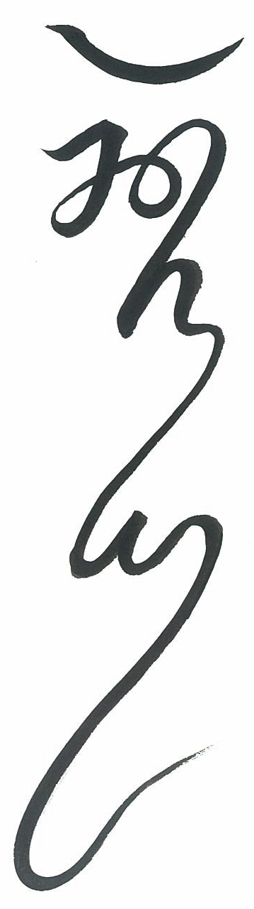

Karya is a music sequencer.

Its main goal is to let you write a high level score which is then realized to
expressive and idiomatic instrumental parts, primarily for electronic music.
It's not oriented around realtime use, or recording realtime input.

It uses its own score format.  One way to look at it is a 2D language for
expressing music along with an editor for that language.  The score language
has a built-in library of notation and has basic means for defining new
notation, but more complicated notation is defined in haskell.  The idea is to
have a standard library, but also be able to define notation specific to your
score.  The editor is graphical but also uses a haskell REPL for configuration,
automation, and extension.  If you're familiar with Amiga-style trackers, it
looks somewhat similar, but fundamentally it's closer to a programming
language.

The primary backend is MIDI, though it can also produce lilypond if you
restrict yourself to the subset of notation that can be translated to staff
notation.  It doesn't record audio or host VSTs, but you can use a DAW to
host VSTs and effect, and record tracks.  You can sync with MTC and MMC to
record live audio, but I haven't tested that much yet.

I develop on OS X.  It should theoretically work on linux, and there is a JACK
backend, but I haven't done much testing there.

As far as I know, there are no other sequencers with similar goals and
features, but if there are, I'd be interested in hearing about them.

Calligraphy is by 黃世昌 / Samson Huang.

## Music, screenshots, examples

- [Music examples with screenshots.](examples.md.html)

## Download

<http://hub.darcs.net/elaforge/karya/>

It's source-only.  Since it uses a REPL, a binary distribution wouldn't make
much sense.

## Features:

- Ornaments.  There is a library of musical ornaments, such as grace notes,
tuplets, trills of various flavor, arpeggio, echo, delay, etc.  These are
called "calls", because they are analogous to function calls.  They can be
arbitrarily complicated.  For example, there are postprocessing operations that
apply instrument-specific restrictions or idioms, such as selecting a string
for a given pitch, or adding pitch sloppiness to especially rapid notes.
Another may simply put a "pizz" attribute on a note or section of score, or
slide between two pitches in a certain way.  Calls may vary by instrument or
scale, so a piano instrument might implement a slur as a change in note
duration, while a sampler-based string instrument might emit a keyswitch or
control change.  There are notation libraries and scales for for European,
Balinese, and Carnatic music.  [Call documentation.](calls.html)

    Scores are composed hierarchically, and there's no strict division between
call that modifies or emits a single note and one that modifies or produces an
entire piece, so the entire score is a call too.  Calls can take arguments and
be written with custom symbols, and when the existing ones aren't sufficient
you can create your own.

- Pitch control.  You have full control over the pitch of each note, and can
apply customized forms of vibrato, portamento, vocal ornaments, or whatever
else, all within whatever scale is in use.  The same goes for other control
signals.  The MIDI backend can automatically multiplex an instrument across
multiple channels to keep control changes isolated to their intended notes.
Unfortunately this usually requires multiple instantiations of the same
softsynth, or a multitimbral setup on a synthesizer, but it's a MIDI
limitation.

- Scales.  Scales can use custom symbols and can take arguments for per-note
pitch variations.  Scale pitches can depend on signals (e.g. gradually
retuning a scale) or on other instruments (e.g. the intonation of one part is
defined relative to another).  Enharmonics and chromatic and diatonic
transposition are supported for scales that employ those concepts.  You can
define your own scales that involve any combination of the above concepts.
[Scale documentation.](scales.html)

- Tempo control.  You can give separate tempos to separate parts
simultaneously, so you can express that one part is pushing or lagging the
tempo, or that one is swung but another is straight, or swung in a different
way.  Tempos compose, so a rubato can be composed with an accelerando for the
expected effect.  Calls can ignore tempo and play in absolute time, so a
trill can choose to either stretch with a tempo change or remain at a constant
speed and add cycles.  They can also change based on tempo, so ornaments can
change how they are realized, or pitches become less precise, as the tempo
increases.

- Integration.  The derived output of a bit of score can be integrated back
into another score to produce new parts.  The generated score can then be
further edited, and changes to the original source will be merged into the
modifications, to a limited degree.  For instance, a part that mirrors another
with added idiomatic ornaments plus tweaks, a series of repeats which all
have individual variations, or a whole section which is the reverse of
another section, edited to sound better.

- [REPL](repl.md.html).  All non-GUI interaction is through a command-line
interface, so you can do complicated transformations by writing a function.
The language is Haskell, which the rest of the program is written in, and it
has direct access to all internal funtionality.  You can write your own
commands in a file and make them available at the REPL.

- Instruments.  Instruments can map MIDI CC numbers to symbolic names, support
keyswitches as named attributes, and automatically multiplex MIDI channels to
give note-level control over pitch or control signals.  Instruments can also
bring their own notation and input methods with them, so for instance drums
can come with their own specialized notation and input commands.  Instruments
are collected into a searchable database.  Instruments are mostly defined via
code, but there's also a framework to parse sysex messages for external
synthesizers, or simple patch lists.

- Multiple backends.  The main backend is MIDI, and this is the most well
developed one, but there is also some ability to export to lilypond.
Lilypond export is necessarily limited because it's hard to translate between
different kinds of scores, but with a bit of work you can get
[reasonable looking output.](data/score/viola-sonata.pdf)

- Incremental saving.  The score is continually saved as changes are made.  You
can undo and make different changes, resulting in a branching history.  If
you set checkpoints along the branches you can jump between different versions
at will, and hopefully no edits need ever be lost.  The underlying storage is
git, so you can use the usual git tools to inspect and manipulate it.  Only in
a limited way, though, since the files are binary and it's a "bare" repo with
no checked out files.  I could invent a text format and then diffs would work,
or check out the files, and then manual branches would work, but I haven't had
any motivation to do that yet.

## Weaknesses:

- Complicated.  If there is a bug in a call's implementation it can be a
hassle to track it down what is going wrong and fix it.  Due to [slicing and
inversion](slicing-inverting.md.html), the structure of the score can get
complicated and hard to understand.  There are a lot of tools for inspecting
intermediate output, but sometimes it can feel like debugging a compiler.  And
since it's a rather programmerly view of music and relies on writing code to
perform operations, it will probably never be accessible to non-programmers.

- Slow.  It relies on caching to rederive scores quickly.  If you put your
score together in a way that defeats caching it will start taking a long time
to rederive a score.  Fortunately it's relatively easy to work with the cache
system, and you get notified about cache misses so you should notice when
something goes wrong.  But the cache, as usual, is a source of bugs.

- Greedy.  What with the various caches, an internal focus on simplicity over
efficiency, and plenty of unoptimized bits, it demands quite a lot of memory
and CPU for a program that doesn't actually handle audio.  This could probably
be greatly improved with some optimization work.

- Non-realtime.  While you should be able to play back a score soon after
making changes, it's still oriented around non-realtime score-writing.  You
cannot change a playback in progress.  You can't record MIDI in realtime,
partially because it's hard to reconcile a low-level recorded performance with
a high-level handwritten score, but mostly because I haven't gotten around to
adding that feature.  It wouldn't be hard to add though.

- Complicated MIDI routing.  Since it doesn't host plugins itself you have to
route MIDI to a plugin host, which likely requires a bunch of virtual MIDI
ports.  On OS X you can use IAC ports, on Linux you can make a bunch of JACK
ports.  If you route to a DAW like Reaper or Ardour you can then bounce or
"freeze" tracks by recording in the DAW, but since neither of these programs
provide much remote control ability you likely have to set up the routing
yourself.  I can do some limited integration with MMC and MTC sync, but closer
integration is harder given that JACK is only supported by Ardour and Rewire is
aggressively proprietary.

- MIDI limitations. Due to MIDI being crummy, you'll need a lot of MIDI ports
and channels, and will be limited to low resolution controls, on both value and
time axes.  The underlying problem is the software synths, which have all
deeply embedded MIDI's limitations.  To solve this we'd need to drag software
synths out of the '80s, create a new high-resolution protocol, and modify the
major samplers and synthesizers to support it.  This will surely never happen,
because there were no sequencers or input devices to generate the high
resolution output, and no tradition of music that relies on it.  I think VST's
"automation parameters" are basically higher resolution MIDI controls, so some
of this could probably be ameliorated by extending a VST host to turn high
resolution OSC into VST automation.  As far as I know there is no program that
does this.  Probably the fundamental problem is that no one cares much about
this issue.

- The score format tries to be simple and general, but the price is that it's
not as efficient as more specialized notation.  For example, staff notation
can display vertical structure (chords and harmony) and binary rhythms very
compactly, but falls apart with different scales or additive rhythms.
Similarly, since time is explicit and spatial, it's less efficient than
notation which can make assumptions about the rhythmic conventions, such as
written konnakol or Javanese kepatihan.  To deal with that, I have
specialized DSLs for things like konnakol which output score notation.

- At the moment it's still early in development, and has many underdocumented
and buggy parts.  It's also changing rapidly, and code written against internal
interfaces may be broken by changes down the line.  And there's no defined
external interface yet.  That said, I have scores from 4 years ago that still
work fine, and at worst you can just rewind the repo.

## Documentation

[INSTALL](INSTALL.md.html) has the usual build instructions.  The
[quickstart](quickstart.md.html) covers basic configuration.  This is the
closest there is to "how to do it" documentation, the rest is reference style
and maybe hard to get a big picture from.

For the purposes of documentation, there are several major layers:

- [UI](ui.md.html) documents the visible UI.  If Karya is a language, then the
UI is the concrete syntax.

- [Cmd](cmd.md.html) is intimately tied to the UI, since it's the way user
actions on the UI get turned into score edits.

- [Derivation](derivation.md.html) is the process of converting the UI-level
score into medium-level score events.  This is where the complexity of score
interpretation is.

- [Performance](performance.md.html) converts the medium-level score events to
the low level output that can directly produce sound.  What this is depends on
the backend.  For example, the MIDI backend converts score events to MIDI
messages, while the lilypond backend converts them to a lilypond score. Unlike
derivation, there's likely nothing user-configurable here.  The idea is that
score events are basically backend-independent, but there are various hacks
due to the different capabilities of backends, and a certain amount of tangle
due to instruments.  Conceptually, an [instrument](instrument.md.html) is just
a string at the derivation level, but in practice they have various attributes
which affect the derivation level, e.g. a default scale, or even affect the
Cmd layer by bringing custom Cmds into scope.

- [Local](local.md.html) configuration reaches into all the layers, since you
can configure all of them.  Karya's configuration is "self-hosted", i.e.
written in Haskell along with the rest of the app, so there's really no firm
line between configuring it and modifying its code.  However, things in `Local`
are set up for easy modification.

### more details

Don't hesitate to look at [haddock documentation](../haddock/index.html) or the
[source](../hscolour/).  Since using karya probably involves writing code that
interacts with the internal APIs, you'll need to be familiar with at least some
of the implementation.  Sometimes the documentation isn't exported as haddock,
so if the haddock seems sparse try the "source" link.  Whenever possible, I try
to keep documentation in the haddock, since it's easier to keep up to date if
it's next to the code that implements it.

[My blog](http://elaforge.blogspot.com/) has notes I have taken during
development.  It's mostly just notes to myself.

Karya is divided into several layers, corresponding to the top level
directories in the source tree:

- fltk - Low level C++ to draw the GUI.  Nothing much interesting here unless
you like reading C++.  But if you do, get in there and make it better, I'm no
good at it.

- Ui - The UI level has the data structures that hold the score, all collected
in 'Ui.Ui.State'.  They mostly correspond directly to what is visible in the
GUI.  This is what gets saved when you save a score.  If you study the UI state
and follow some of the links, you can get an idea of what a score actually is.

- Cmd - Cmds take user input and transform the Ui state.  This layer handles
all user interaction.  'Cmd.Cmd.State' is the non-score app state.  If you
study the Cmd state and follow links, you can get an idea of the various
features supported.  The UI state plus the Cmd state is all the state in the
app, except the GUI state stashed in C++, so if you have a handle on those two
then you have a good handle on the whole program.

- Derive - The deriver interprets the Ui State and turns into into a stream of
lower level events.  It implements the "tracklang" language documented in the
[derivation docs](derivation.md.html).

- Perform - The perform layer turns Derive output into a backend specific
format, e.g. MIDI messages or lilypond score.  It's also responsible for
"playing" the output, e.g. scheduling MIDI messages with the MIDI driver or
calling lilypond.

The main program is called `seq`, but there are a few auxiliary programs:

- logview - 'LogView.LogView' is a separate program that formats log output.
The karya GUI doesn't have a place for global information, so logview serves
this purpose too.  When log messages display stack traces, you can double click
them to highlight their positions in the score.

- browser - 'Instrument.Browser' is a simple browser for the instrument
database.  To the UI and Derive layers, an instrument is just a text string,
but they have quite a bit of extra information associated with them which is
important to the performer.

- make_db - If the instruments involve expensive operations like parsing
directories full of sysex messages, they can serialize the parsed instruments
to disk.  What this is exactly depends on the per-synth definitions in
Local/Instrument/.  `make_db` just runs each instrument's `make_db` function.

- [repl](repl.md.html) - This connects to a running sequencer and lets you
interact at the programmatic level by sending haskell expressions to be
evaluated in the Cmd context.  `send` is a one-off version of repl that can be
used to send a single command.

- extract_doc - This extracts documentation and saves it as HTML.  That
includes the [global keymap](keymap.html), [builtin calls](calls.html), and
[builtin scales](scales.html).
